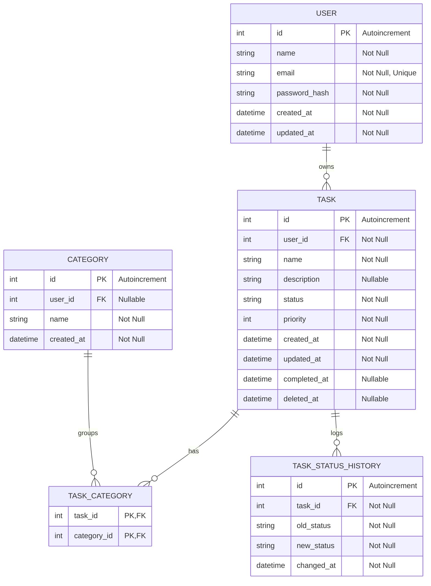
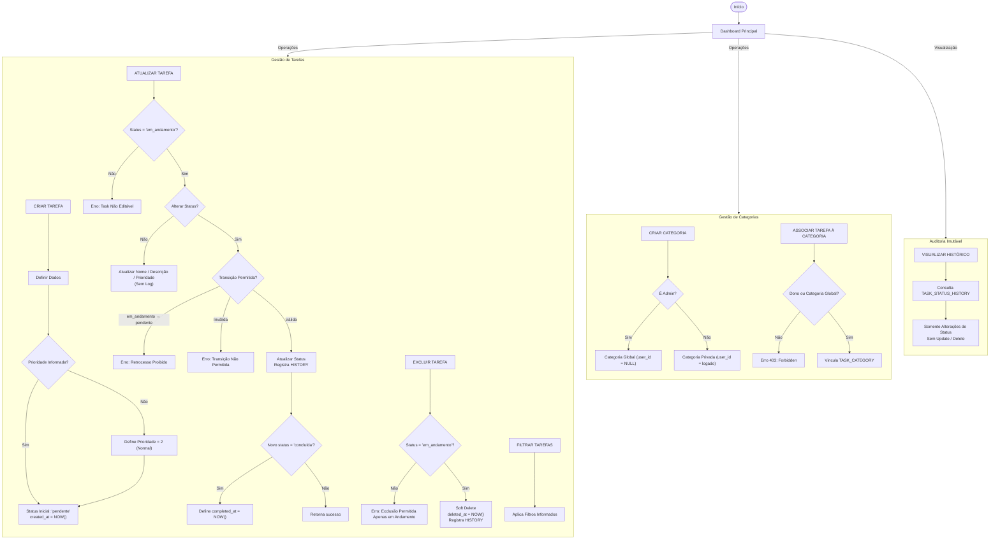

# 📝 API de Registro de Atividades
Um projeto totalmente funcional, desenvolvido em PHP 8.1+ com Symfony, demonstrando uma API REST robusta utilizando princípios de DDD (Domain-Driven Design).

Este projeto foi desenhado para servir como um modelo de backend escalável, apresentando funcionalidades avançadas como histórico de status, categorias dinâmicas, e segurança via JWT.


### O que este projeto demonstra:
* Arquitetura DDD: Separação clara entre Domínio, Aplicação, Infraestrutura e Interface de Usuário.

* Persistência Avançada: Uso do Doctrine ORM com MySQL, implementando Soft-Delete e histórico de logs.

* Segurança: Autenticação via JWT e hashing de senhas.

* Qualidade de Código: Testes unitários e testes de integração .

* Padronização REST: Respostas JSON consistentes para sucesso e erro.
  
---

## Critérios de aceite

* Padrão de desenvolvimento DDD aplicado.
* Status Inicial: Toda tarefa nasce como pendente.
* Imutabilidade de Histórico: Alterações de status são registradas permanentemente na tabela TASK_STATUS_HISTORY.
* Prioridades: Codificadas como Enum (1=Alta, 2=Média, 3=Baixa).
* Soft-Delete: Tarefas "excluídas" recebem um timestamp em deleted_at, mantendo a integridade do histórico.

---

## Requisitos para Inicialização do Projeto

* **Linguagem**: PHP 8.1+
* **Framework**: Symfony 6.x
* **ORM**: Doctrine
* **Banco de dados**: MySQL

---
## Regras de Negócio 

| ID    | Regra                          | Descrição                                                                 | Justificativa                                                                                                   |
|------ |--------------------------------|---------------------------------------------------------------------------|-----------------------------------------------------------------------------------------------------------------|
| RN-01 | Imutabilidade de Tarefa Inativa | A edição de dados e exclusão só são permitidas se o status for `em_andamento`. | Garante que o usuário só altere o escopo de tarefas ativas, preservando o histórico do que já foi feito ou não iniciado. |
| RN-02 | Prioridade Padrão               | Se a prioridade não for informada na criação, o sistema atribui automaticamente `2 (Normal)`. | Evita inconsistência no banco de dados e garante que toda tarefa tenha um peso para ordenação.                  |
| RN-03 | Bloqueio de Retrocesso          | É proibido transitar uma tarefa de `em_andamento` para `pendente`.           | Preserva o fluxo lógico de progresso; uma tarefa iniciada deve ser concluída ou cancelada, nunca “reiniciada”. |
| RN-04 | Exclusão Condicional            | O Soft Delete só é permitido se a tarefa estiver `em_andamento`.            | Previne a remoção acidental de tarefas finalizadas ou que ainda não começaram.                                  |
| RN-05 | Auditoria Seletiva              | Apenas alterações de **Status** geram log em `HISTORY`.                   | Evita poluição com alterações triviais, focando no ciclo de vida da tarefa.                                     |
| RN-06 | Escopo de Categorias            | Apenas Admin cria categorias Globais. Usuários comuns criam categorias Privadas. | Mantém a organização do sistema e evita poluição da lista global.                                               |
| RN-07 | Segurança na Associação         | O usuário só pode vincular tarefas a categorias que possui ou que são Globais. | Previne acesso indevido e manipulação de recursos de terceiros.                                                 |

---

## Definição Status

**pendente:**
- Task criada com data de criação.
- Nenhuma ação iniciada.
- Não permite edição nem exclusão.

**em_andamento:**
- Task iniciada pelo usuário.
- Permite edição e exclusão (soft delete).
- Permite transição para concluída.

**concluída:**
- Task finalizada com registro de data de conclusão.
- Registro imutável.
- Apenas visualização.

---


## Diagrama DB



---

## Diagrama de fluxo



---

## 🔌 Formato de Resposta API

Sucesso (Ex: 201 Created):

```json
{
  "success": true,
  "status_code": 201,
  "message": "Tarefa criada com sucesso.",
  "data": { "id": 1, "name": "Estudar Symfony" }
}
```

Erro (Ex: 400 Bad Request):

```json
{
  "success": false,
  "message": "Status inválido",
  "errors": { ["Valor inválido"] }
}
```

---

## 🤝 Como contribuir

Encontrou um bug ou tem uma sugestão de melhoria?

* Abra uma Issue detalhando o problema.
* Envie um Pull Request referenciando a Issue.
* Certifique-se de que os testes estão passando: `php bin/phpunit`.


---

## ⭐ Gostou do projeto? 
Sinta-se à vontade para dar um fork e usar como base para seus próprios estudos


